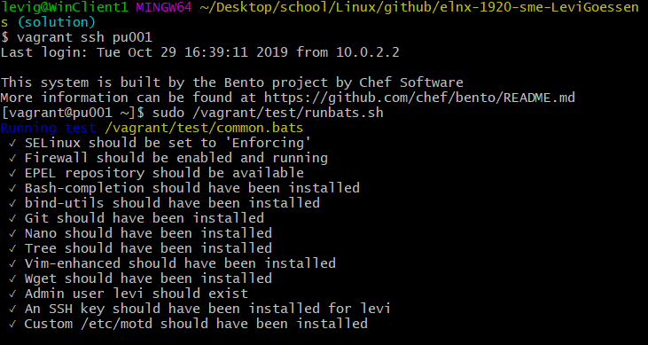

# Enterprise Linux Lab Report Assignment 00-server-setup

- Student name: Levi Goessens
- Github repo: <https://github.com/HoGentTIN/elnx-1920-sme-LeviGoessens>

Describe the goals of the current iteration/assignment in a short sentence.
```
Het opzetten van de basic server waarvan de andere servers gebruik kunnen maken.
```
## Test plan

1. In de lokale map gaan we naar de plaats met de vagrant file en doen we 'Git bash here'.
2. Met de command 'vagrant status' checken we de vms, bij pu001 zou 'not created' moeten staan, indien dit niet het geval is doen we eerst een **vagrant destroy pu001**.
3. Voer het commando **vagrant up pu001** uit.
4. Log in op de server met het commando **vagrant ssh pu001**
5. Nu kunnen we de testen runnen die te vinden zijn in /vagrant/test/runbats.sh (uitvoeren met sudo)
6. Alle tests die slagen op dit gedeelte moeten slagen, indien dit het geval is zullen de volgende tests falen, dit is normaal (behoort tot volgende opdracht).
7. nadat we opnieuw uitgelogd zijn moeten we nu ook met het volgende commando kunnen verbinden: **ssh levi@192.0.2.50**, ZONDER een password prompt.


## Procedure/Documentation

1. We werken steeds in de lokale map(elnx-1920-sme-LeviGoessens) in de map Ansible
2. We passen het bestand vagrant-hosts.yml aan zodat de server wordt toegevoegd:
    ```
        - name: pu001
          ip: 192.0.2.10
    ```
3. Vervolgens passen we het bestand site.yml aan
    ```
        - host: pu001
          become: true
          roles: 
          - bertvv.rh-base
    Op deze manier voegen we de verschillende servers toe, steeds met de rollen voor de specifieke opdracht 
    (te vinden vie ansible galaxy, bertvv)
    ```
4. Indien hier een rol wordt toegevoegd, dient op de server het volgende commando gebruikt te worden: 
**./scripts/role-deps.sh**
5. We moeten nu de nodige zaken toevoegen in group_vars/all.yml (deze zaken worden op elke server gebruikt)
    - De EPEL Repository
    ```
        rhbase_repositories:
          - epel-release
    ```
    - De verschillende packages worden toegevoegd: 
    ```
    rhbase_install_packages:
      - bash-completion
      - bind-utils
      - git
      - nano
      - tree
      - vim-enhanced
      - wget
    ```
    - We moeten ook de User toevoegen met zijn SSH keys.
    ```
    rhbase_users:
      - name: levi
        groups:
          - wheel
        password: "password"
    
    rhbase_ssh_user: levi
    rhbase_ssh_key: ssh-rsa "de gegenereerde key"
    ```
    - Tot slot voegen we een MOTD toe:
    ```
    rhbase_motd: true
    ```


## Test report

- We voeren het commando **sudo vagrant/test/runbats.sh** uit, indien alle testen slagen is deze opdracht geslaagd.


## Resources

- https://galaxy.ansible.com/bertvv/rh-base
