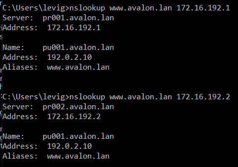

# Enterprise Linux Lab Report Assignment 01-lamp

- Student name: Levi Goessens
- Github repo: <https://github.com/HoGentTIN/elnx-1920-sme-LeviGoessens>

Describe the goals of the current iteration/assignment in a short sentence.
```
Opzetten van een LAMP-stack via Ansible om zo de installatie en configuratie te automatiseren.
```

## Test plan

1. In de lokale map gaan we naar de plaats met de vagrant file en doen we 'Git bash here'.
2. Met de command 'vagrant status' checken we de vms, bij pu001 zou 'not created' moeten staan, indien dit niet het geval is doen we eerst een **vagrant destroy pu001**.
3. Voer het commando **vagrant up pu001** uit.
4. Log in op de server met het commando **vagrant ssh pu001**.
5. Nu kunnen we de testen runnen die te vinden zijn in /vagrant/test/runbats.sh (uitvoeren met sudo). Deze moeten nu allemaal slagen.
6. Als pu001 Up is, kunnen we de default pagina zijn van wordpress door op onze host te surfen naar http://192.0.2.10/wordpress/.


## Procedure/Documentation
1. We voegen een entry toe aan vagrant-hosts voor pu001 (subnetmask hoeft hier niet, is standaard 255.255.255.0):
	```
	- name: pu001
	  ip: 192.0.2.10
	```

2. Site.yml aanpassen, er zijn nu extra benodigdheden voor pu001.
    ```
    - hosts: pu001
      become: true
      roles:
        - bertvv.rh-base
        - bertvv.httpd
        - bertvv.mariadb
        - bertvv.wordpress
    ```
3. We maken een folder 'host_vars' aan in de ansible folder, hierin komt de pu001.yml file.
4. Met de role rh_base zorgen we ervoor dat de firewall doorgang verleent voor webservices en ssh:
    ```
    rhbase_firewall_allow_services:
      - http
      - https
      - ssh
    ```
5. Opzetten van een MariaDB mirror zodat het proces sneller verloopt:
    ```
    mariadb_mirror: 'mariadb.mirror.nucleus.be/yum'
    ```
6. Instellen van gegevens voor MariaDB user, database en wachtwoord (we kiezen hier voor zelfde gegevens als in test files)
    ```
    mariadb_databases:
      - name: wp_db

    mariadb_root_password: fogMeHud8

    mariadb_users:
      - name: wp_user
        password: CorkIgWac
        priv: 'wp_db.*:ALL,GRANT'
    ```
7. Instellen gegevens voor Wordpress user, database en wachtwoord (Belangrijk: gebruik zelfde gegevens als bij MariaDB)
    ```
    wordpress_user: wp_user
    wordpress_password: CorkIgWac
    wordpress_database: wp_db
    ```
8. Voor het toevoegen van de certificaten volgen we de guide (https://wiki.centos.org/HowTos/Https)
    ```
    De certificates steken we in een map 'files' in de map ansible.
    We verwijzen hiernaar in pu001.yml:

    httpd_ssl_certificate_key_file: 'ca.key'
    httpd_ssl_certificate_file: 'ca.crt'
    ```

## Test report

- We voeren het commando **sudo vagrant/test/runbats.sh** uit, indien alle testen slagen is deze opdracht geslaagd.

- Via http://192.0.2.10/wordpress/ moet de default pagina zichtbaar zijn.


## Resources
	```
        - https://galaxy.ansible.com/bertvv/rh-base
	- https://galaxy.ansible.com/bertvv/httpd
	- https://galaxy.ansible.com/bertvv/wordpress
	- https://galaxy.ansible.com/bertvv/mariadb
	- https://wiki.centos.org/HowTos/Https
        - https://www.ibm.com/cloud/learn/lamp-stack-explained
	```

