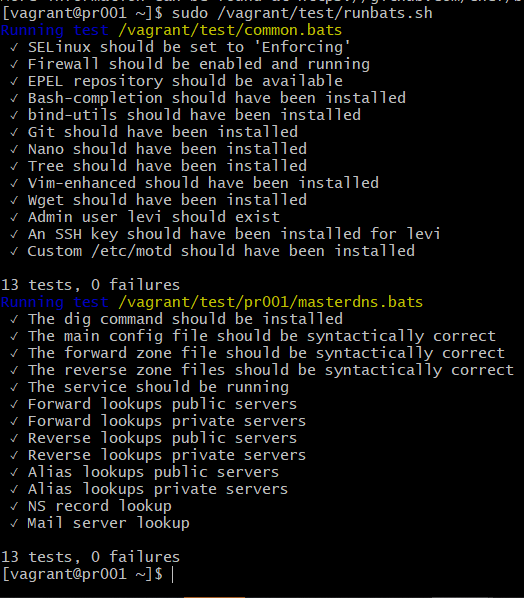
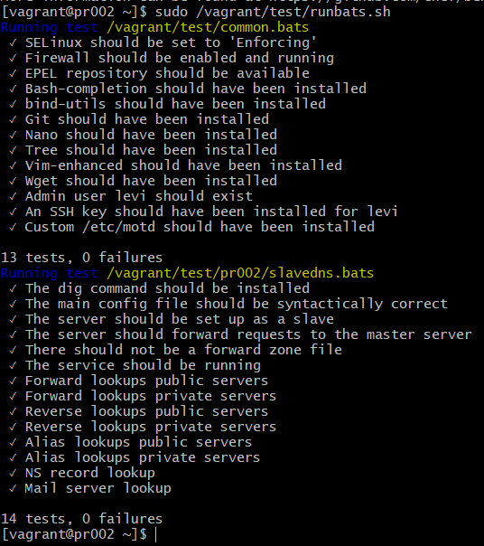
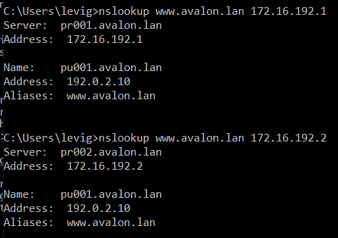

# Enterprise Linux Lab Report Assignment 02-DNS

- Student name: Levi Goessens
- Github repo: <https://github.com/HoGentTIN/elnx-1920-sme-LeviGoessens>

Describe the goals of the current iteration/assignment in a short sentence.
```
Opzetten van een LAMP-stack via Ansible om zo de installatie en configuratie te automatiseren.
```

## Test plan

1. In de lokale map gaan we naar de plaats met de vagrant file en doen we 'Git bash here'.
2. Met de command 'vagrant status' checken we de vms, bij pr001 zou 'not created' moeten staan, indien dit niet het geval is doen we eerst een **vagrant destroy pr001**.
3. Hetzelfde geldt voor pr002, bij pr002 zou 'not created' moeten staan, indien dit niet het geval is doen we eerst een **vagrant destroy pr002**.
4. Voer het commando **vagrant up pr001 pr002** uit.
5. Log in op de servers met de commandos **vagrant ssh pr001** en **vagrant ssh pr002**.
6. Nu kunnen we de testen runnen die te vinden zijn in /vagrant/test/runbats.sh (uitvoeren met sudo). Deze moeten allemaal slagen.


## Procedure/Documentation

1. We voegen entries toe in vagrant-hosts voor beide servers (hier is subnetmask wel van belang, want is standaard 255.255.255.0):
	```
	- name: pr002
  	  ip: 172.16.192.2
  	  netmask: 255.255.0.0

	- name: pr011
  	  ip: 172.16.192.11
  	  netmask: 255.255.0.0
	```
2. Site.yml aanpassen, We voegen pr001(Master DNS) en pr002(Slave DNS) toe. Beide servers gebruike zelfde rollen:
    ```
    - bertvv.rh-base
    - bertvv.bind
    ```
### pr001
1. In host_vars voegen we pr001.yml toe.
2. We maken gebruik van de rh_base role om de service DNS door te laten:
	```
	rhbase_firewall_allow_services:
          - dns
	```
3. De enige echte requirement is het meegeven van het master dns ip adres:
	```
	bind_zone_master_server_ip: 172.16.192.1
	```
4. Dit is nog niet genoeg om aan alle vereisten te voldoen, vervolgens geven we mee welke hosts naar de DNS mogen queryen en op welke interfaces er geluisterd moet worden.
	```
	bind_listen_ipv4:
  	  - any
	bind_allow_query:
          - any
	```
5. We stellen bind_zone_domains in:
	- **name**, De naam van het domein, in dit geval avalon.lan
	- **hosts**, Een opsomming van alle hosts(zoals in de topologie) met steeds de **name**, het **ip** en de **aliases**.
	- **networks**, De verschillende netwerken, in ons geval '192.0.2' en '172.16'.
	- **name_servers**, de namen van de DNS servers, in ons geval pr001 en pr002.
	- **mail_servers**, zoals in de opgave, hier moeten we de mailserver meegeven, **name: pu002** met als **preference: 10**.

### pr002
1. pr002 zal synchroniseren met pr001
2. In host_vars voegen we pr002.yml toe.
3. We maken gebruik van de rh_base role om de service DNS door te laten:
	```
	rhbase_firewall_allow_services:
          - dns
	```
4. De enige echte requirement is het meegeven van het master dns ip adres:
	```
	bind_zone_master_server_ip: 172.16.192.1
	```
5. Dit is nog niet genoeg om aan alle vereisten te voldoen, vervolgens geven we mee welke hosts naar de DNS mogen queryen en op welke interfaces er geluisterd moet worden.
	```
	bind_listen_ipv4:
  	  - any
	bind_allow_query:
          - any
	```
6. Aangezien dit de slave DNS is, moeten we hier alleen domain name en networks meegeven.
 	- name: 'Avalon.lan'
	- networks: '192.0.2' en '172.16'

	

## Test report

- We voeren het commando **sudo vagrant/test/runbats.sh** uit op beide servers, alle tests moeten slagen.



- Indien alles correct geconfigureerd is, is het ook mogelijk om vanop onze host machine een nlookup uit te voeren met de onze DNS servers
	```
	Aangezien het een authoritative-only DNS server kunnen we het volgende uitvoeren:
	nslookup www.avalon.lan 172.16.192.1 en nslookup www.avalon.lan 172.16.192.2
	```



## Resources

	- https://galaxy.ansible.com/bertvv/rh-base
	- https://galaxy.ansible.com/bertvv/bind
	- https://ns1.com/resources/what-exactly-is-secondary-dns

