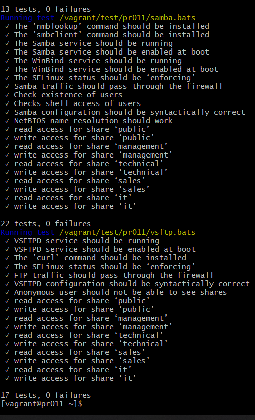
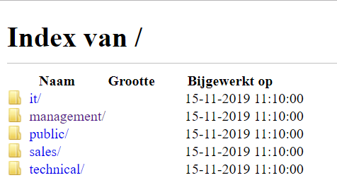
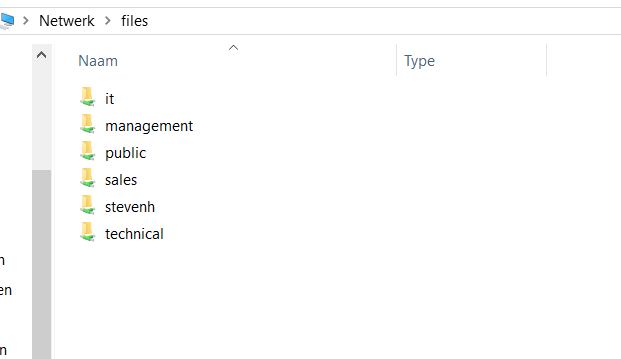

# Enterprise Linux Lab Report Assignment 03-fileshare

- Student name: Levi Goessens
- Github repo: <https://github.com/HoGentTIN/elnx-1920-sme-LeviGoessens>

Describe the goals of the current iteration/assignment in a short sentence.

Opzetten van een fileshare server via Ansible om zo de installatie en configuratie te automatiseren voor zowel SMB als FTP.


## Test plan

1. In de lokale map gaan we naar de plaats met de vagrant file en doen we 'Git bash here'.
2. Met de command 'vagrant status' checken we de vms, bij pr011 zou 'not created' moeten staan, indien dit niet het geval is doen we eerst een **vagrant destroy pr011**.
3. Voer het commando **vagrant up pr011** uit.
4. Log in op de servers met de commandos **vagrant ssh pr011**.
5. Nu kunnen we de testen runnen die te vinden zijn in /vagrant/test/runbats.sh (uitvoeren met sudo). Deze moeten allemaal slagen.


## Procedure/Documentation

1. We voegen entries toe in vagrant-hosts voor de server pr011(hier is subnetmask wel van belang, want is standaard 255.255.255.0):
	```
	- name: pr011
  	  ip: 172.16.192.11
  	  netmask: 255.255.0.0
	```
2. Site.yml aanpassen, We voegen pr011 toe met de volgende roles: 
    ```
    - bertvv.rh-base
    - bertvv.samba
    - bertvv.vsftpd
    ```
3. In host_vars voegen we pr011.yml toe.
4. We maken gebruik van de rh_base role om de service ftp en samba door te laten:
	```
	rhbase_firewall_allow_services:
      - samba
	  - ftp
	```
5. Toevoegen van User groups met rh-base zoals beschreven in de opgave:
	```
	rhbase_user_groups:
	  - management
	  - technical
	  - sales
	  - it
	  - public
	```
6. We maken nu alle users aan met rh-base zoals weergegeven in avalon-employees.csv. We geven steeds de volgende zaken mee:
	```
	- name (vb. stevenh)
	- comment (vb. Steven Hermans, 'management')
	- password (de passwords worden meegegeven als hash, password is zelfde als name maar dan als crypt-sha512 via 'https://www.mkpasswd.net/', begint steeds met $6$).
	- groups (de groups waarin de users zich bevinden, in dit geval management alsook public(geldt voor iedereen).)
	```
7. We moeten ook een user voor onszelf aanmaken, in mijn geval levi(moet zelfde naam zijn als user in site.yml!). Deze user is iets uitgebreider:
	```
  - name: levi
    comment: 'Levi Goessens'
    shell: /bin/bash
    password: '$6$okIzfm.ePHTVI7CF$.TPHweD70gS5mYnfGMgo.JwTaia/d9HR8K3Y5VsGpmviuDDgVr9Dt7Da4yA6B0Hy7qnG9mdOK.xiMOzQR1xsQ0'
    groups:
      - wheel
      - users
      - public
      - it
	```
8. Vervolgens gaan we de samba rol configureren, de nodige serverinstellingen zijn:
	```
	samba_netbios_name: FILES
	samba_load_homes: true
	samba_workgroup: AVALON
	samba_create_varwww_symlinks: true
	samba_load_printers: false
	```
9. Ook samba heeft alle voorgaande users nodig, alleen minder uitgebreid:
	```
	- name: levi
	  password: levi
	```
10. Als laatste moeten we voor samba ook shares aanmaken. Per departement geven we de volgende zaken mee (volgens de opgave):
	```
	- name: (de verschillende departementen, vb. management)
      comment: (extra info, vb. 'Share voor de business unit management')
      group: (de user group files zullen in deze share worden toegevoegd, hier management)
      valid_users: +management (wie heeft leesrechten op deze share, kunnen meerdere departementen zijn gescheiden door een komma)
      write_list: +management(wie heeft schrijfrechten op deze share, steeds het departement zelf)
      directory_mode: '0770' (extra permissies indien nodig)
	```
11. Vervolgens gaan we de vsftpd rol configureren, de nodige serverinstellingen zijn:
	```
	vsftpd_anonymous_enable: false
	vsftpd_local_enable: true
	vsftpd_local_root: '/srv/shares/'
	```
12. Ook hier moeten we extra permissies meegeven om de testen te laten slagen (volgens de opgave):
	```
	vsftpd_extra_permissions:
 	 - folder: '/srv/shares/sales'
   	   entity: 'management'
       etype: 'group'
       permissions: 'r-x'
     - folder: '/srv/shares/it'
       entity: 'management'
       etype: 'group'
       permissions: 'r-x'
	```

## Test report

- We voeren het commando **sudo vagrant/test/runbats.sh** uit op de server pr011, alle tests moeten slagen.


- Indien alles correct geconfigureerd is, is het ook mogelijk om op de volgende manieren de shares te bekijken:
	```
	- In browser surven naar ftp://172.16.192.11 en inloggen als een van de voorgaande users
	```
	
	```
	- in file explorer \\files\ typen en inloggen als een van de voorgaande users
	```
	

	

## Resources

    - https://galaxy.ansible.com/bertvv/rh-base
	- https://galaxy.ansible.com/bertvv/samba
	- https://galaxy.ansible.com/bertvv/vsftpd
	- https://www.mkpasswd.net/
	- https://www.samba.org/samba/docs/current/man-html/smb.conf.5.html


