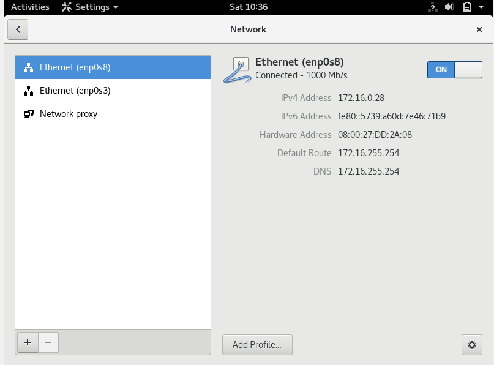
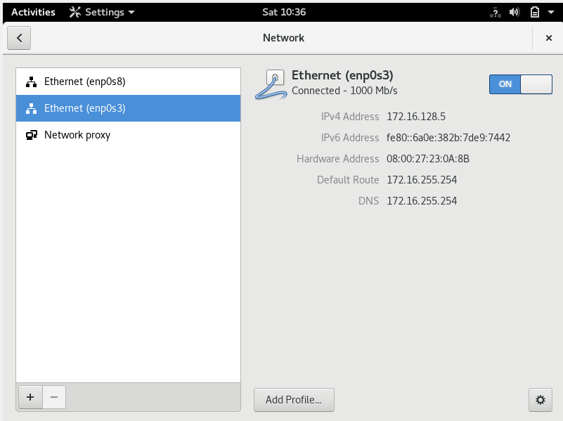
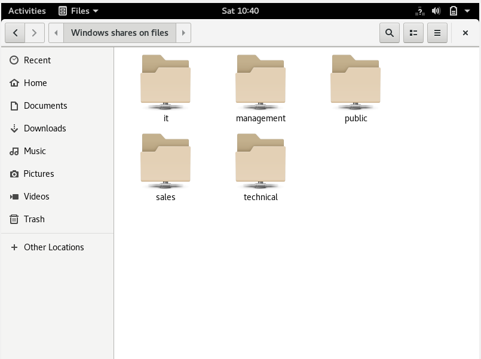

# Enterprise Linux Lab Report Assignment 04-Integration

- Student name: Levi Goessens
- Github repo: <https://github.com/HoGentTIN/elnx-1920-sme-LeviGoessens>

Describe the goals of the current iteration/assignment in a short sentence.
	```
Installatie en configuratie van DHCP server met ansible, opzetten van een router met VyOs.
	```

## Test plan

1. In de lokale map gaan we naar de plaats met de vagrant file en doen we 'Git bash here'.
2. Met de command 'vagrant status' checken we de vms, bij pr003 zou 'not created' moeten staan, indien dit niet het geval is doen we eerst een **vagrant destroy pr003**.
3. Hetzelfde geldt voor pr002, bij pr002 zou 'not created' moeten staan, indien dit niet het geval is doen we eerst een **vagrant destroy pr003**.
4. Voer het commando **vagrant up pu003** uit.
5. Voor deze opdracht zijn er geen testscripts, we moeten manueel een vm aanmaken met 2 host-only adapters.
6. Indien deze vm 1 gereserveerd ip address krijgt en 1 address uit de dhcp pool is dhcp goed ingesteld.
7. Indien we zowel naar een externe site zoals www.google.com, als naar een site binnen het domein zoals avalon.lan/wordpress kunnen surven kloppen de DNS instellingen van de router.
8. Ten slote controlleren we of we via de file toegang hebben toch SBM & FTP, indien dit klopt is de integratie volledig succesvol.


## Procedure/Documentation

1. We voegen entries toe in vagrant-hosts voor de DHCP server:
	```
	- name: pr003
  	  ip: 172.16.192.3
  	  netmask: 255.255.0.0
	```
2. Site.yml aanpassen, We voegen pr003 toe:
    ```
	- name: pr003
      - bertvv.rh-base
      - bertvv.dhcp
	 ```
### DHCP

1. In host_vars voegen we pr003.yml toe.
2. We maken gebruik van de rh_base role om de service **DHCP** en **SSH** door te laten:
	```
	rhbase_firewall_allow_services:
          - ssh
		  - dhcp
	```
3. Een aantal van de default dhcp instellingen zijn (deze zijn terug te vinden in de opgave):
	```
	dhcp_global_domain_name: 'avalon.lan'
	dhcp_global_domain_name_servers:
	  - 172.16.255.254
	  - 192.0.2.254
	dhcp_global_routers: 172.16.255.254
	dhcp_global_subnet_mask: 255.255.0.0
	dhcp_global_default_lease_time: 43200
	```
4. We gaan nu een dhcp subnet maken (zoals aangegeven in de opgave):
	```
	dhcp_subnets:
      - ip: 172.16.0.0
        netmask: 255.255.0.0
        domain_name_servers:
          - 172.16.255.254
        range_begin: 172.16.0.2
        range_end: 172.16.127.254
        default_lease_time: 14400
	```
5. Aangezien de vm een gerserveerd ip address(172.16.128.1 - 172.16.191.254) moet krijgen voegen we het volgende toe:
	```
	#Het mac address kopieren we van een van de host-only adapters
		dhcp_hosts:
		- name: 'ws0001'
			mac: '08:00:27:23:0A:8B'
			ip: 172.16.128.5
	```
	
### router
1. Voor de router wordt geen gebruik gemaakt van een yml file aangezien we het niet als host aanzien.
2. Er is wel reeds een config file(router-config.sh) aanwezig in de map scripts, waar nog wat aan moet worden toegevoegd.
3. Eerst installeren we een plugin om VyOS ook zonder vagrant te laten werken `sudo vagrant plugin install vagrant-vyos`.
4. We kunnen de router nu aanzetten met vagrant up, na wijzigingen in de config file voeren we het script uit met ./router-config.sh
5. We maken gebruik van https://github.com/bertvv/cheat-sheets/blob/master/docs/VyOS.md om de router in te stellen.
6. We stellen nu de verschillende onderdelen in:
### IP settings
1. In de opgave staan de verschillende interfaces (eth0-2) beschreven, telkens met het ip address en de remark, alsook met welke interface ze connecteren.
2. eth0 is de NAT adapter, krijgt zijn address via DHCP en heet "WAN", eth1 zal 'DMZ' connecteren op 192.0.2.254/24 en eth2 zal "INTERNAL" verbinden op 172.16.255.254/24
3. We noteren dit op de volgende manier:
	```
	set interfaces ethernet eth0 address dhcp
	set interfaces ethernet eth0 description WAN

	set interfaces ethernet eth1 address 192.0.2.254/24
	set interfaces ethernet eth1 description DWZ

	eth2 volgt dezelfde standaard als eth1
	```
### NAT
1. Voor de NAT instellingen voegen we twee source rules toe, 100 en 101(incrementen met meer is mogelijk)
2. Voor interface eth0 en eth1(source address en translation address zijn voor beide interfaces hetzelfde):
	```
	set nat source rule 100 outbound-interface 'eth0'
	set nat source rule 100 source address '172.16.0.0/16'
	set nat source rule 100 translation address 'masquerade'

	```
### Time
1. Om de tijdsinstellingen van de router aan te passen gebruiken we de commando's die terug te vinden zijn op www.pool.ntp.org/zone/be
2. Wanneer we op de router inloggen en set system time-zone Europe/ tab doen krijgen we een lijst, we kiezen hier voor Brussels
3. We kunnen nu de time-zone en de ntp servers toevoegen
	```
	set system time-zone 'Europe/Brussels'
	set system ntp server '0.be.pool.ntp.org'
	set system ntp server '1.be.pool.ntp.org'
	set system ntp server '2.be.pool.ntp.org'
	set system ntp server '3.be.pool.ntp.org'
	```

### DNS
1. Voor de DNS instellingen volgen we ook de opdracht, requests binnen het domain worden afgehandeld door onze DNS server: pr001
	```
	set service dns forwarding domain avalon.lan server 172.16.192.1
	```
2. Externe requests worden geforward naar het correcte ip address:
	```
	set service dns forwarding dhcp 'eth0'
	set service dns forwarding listen-on 'eth1'
	set service dns forwarding listen-on 'eth2'
	```


	

## Test report

- Onze host krijgt 2 ip addressen via DHCP, 1 address is gereserveerd a.d.h.v. het mac address, het andere krijgt een address uit de pool:


- We kunnen surven naar zowel een externe site als naar een site binnen het domein:


- De fileserver is beschikbaar:



## Resources

	- https://galaxy.ansible.com/bertvv/rh-base
	- https://galaxy.ansible.com/bertvv/bind
	- https://ns1.com/resources/what-exactly-is-secondary-dns

